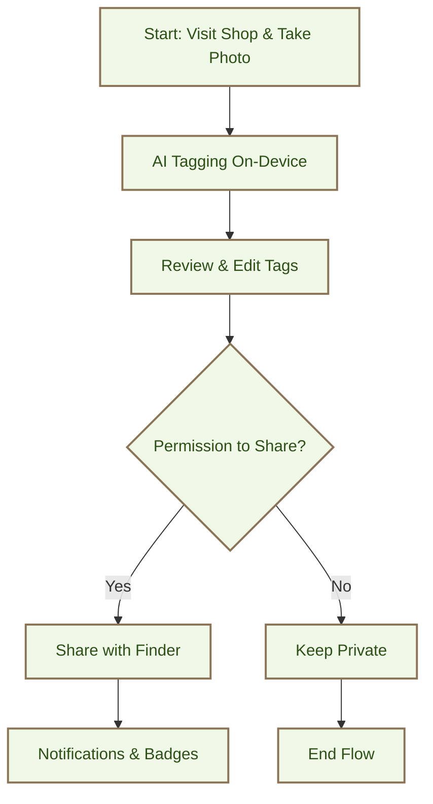

# Sharing Flow

## Overview

This Mermaid flowchart represents the Sharing Flow (User Flow 3) as a mobile-optimized wireframe sequence. Each node depicts a key screen or step in the flow, designed for touch interactions on mobile devices. The diagram emphasizes the boho UX, privacy focus, and community-driven discovery.

## Flowchart

## Screen Descriptions (Mobile-Optimized)

- **A: Start - Visit Shop & Take Photo**
  - Full-screen camera view
  - Centered frame for item
  - Bottom: [Capture] button (circular, earthy green) and [Cancel] (text)
  - Mobile: Thumb-friendly buttons, portrait orientation

- **B: AI Tagging On-Device**
  - Photo preview at top
  - List of AI-generated tags (e.g., "Vintage Scarf", "1990s-2000s")
  - [Processing...] indicator
  - [Edit Tags] button
  - Mobile: Scrollable tag list, large text for readability

- **C: Review & Edit Tags**
  - Editable tag list with [X] remove buttons
  - - Add Tag input field
  - [Save] and [Cancel] buttons
  - Mobile: Swipe gestures for editing, haptic feedback

- **D: Permission to Share?**
  - Modal dialog: "This item was previously tagged. Notify the finder?"
  - [Yes, Share] (positive, earthy tone) and [No, Keep Private] (neutral)
  - Mobile: Overlay modal, easy tap targets

- **E: Share with Finder**
  - Confirmation screen: "Shared successfully!"
  - Brief animation or checkmark
  - Mobile: Quick transition, no heavy graphics

- **F: Keep Private**
  - Simple "Kept private" message
  - Return to main flow
  - Mobile: Minimal screen to avoid confusion

- **G: Notifications & Badges**
  - Notification banner: "Your [Item] was found by [User]! 🌼"
  - Badge list: "Item Shared" (Finder), "First Find" (Shopper)
  - Mobile: Push notification style, badge icons with leaf motifs

- **H: End Flow**
  - Return to discovery or home screen

## Design Notes

- **Mobile-First:** All screens are portrait-oriented, with touch targets >44px, swipe support.
- **Boho Aesthetic:** Earthy colors (#f0f8e8 background, #8b7355 borders), leaf icons for badges.
- **Accessibility:** High contrast, large fonts for users like Eleanor (67).
- **Privacy Emphasis:** On-device processing highlighted in tags screen.
- **No Transactions:** Focus on discovery connections, no purchase prompts.

## Alignment with Mission & Personas

- Supports intentional discovery for Maya (21), Alex (28), and Eleanor (67).
- Builds community without commercial incentives.
- Mermaid graph visualizes the non-linear permission step for clarity.

To view the diagram, copy the Mermaid code into a tool like Mermaid Live Editor or GitHub Markdown renderer.
