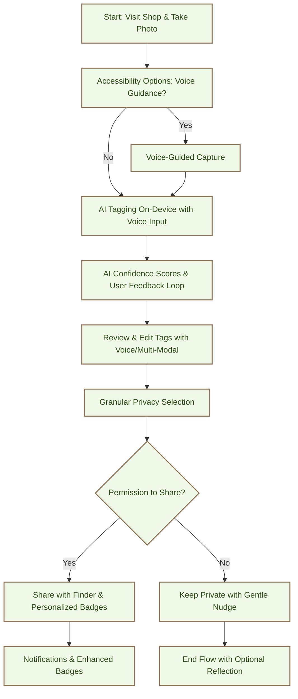

# Sharing Flow (Iterated Version)

## Overview

This iterated Mermaid flowchart represents the updated Sharing Flow (User Flow 3) as a mobile-optimized wireframe sequence, incorporating solutions for pain points like privacy, accessibility, AI accuracy, motivation, and performance. Each node depicts a key screen or step in the flow, designed for touch interactions on mobile devices. The diagram emphasizes the boho UX, privacy focus, and community-driven discovery, with enhancements for inclusivity and user control.

## Flowchart

`

`

## Screen Descriptions (Mobile-Optimized)

- **A: Start - Visit Shop & Take Photo**
  - Full-screen camera view with centered frame.
  - Bottom: [Capture] (circular, earthy green), [Cancel], and new [Voice Guide] toggle for accessibility (e.g., "Say 'capture' to take photo").
  - Mobile: Thumb-friendly, portrait, haptic feedback on capture.

- **A1: Accessibility Options: Voice Guidance?**
  - Modal: "Enable voice guidance for hands-free flow?" [Yes] or [Skip].
  - Mobile: Large buttons, screen reader support.

- **A2: Voice-Guided Capture**
  - Camera with voice overlay: "Position item and say 'capture' or tap button."
  - Processes voice commands via react-native-voice.
  - Mobile: Auto-focus stabilization for Eleanor.

- **B: AI Tagging On-Device with Voice Input**
  - Photo preview at top.
  - AI-generated tags with confidence scores (e.g., "Vintage Scarf - 85% confident").
  - [Add Voice Tag] button for verbal descriptions.
  - [Processing...] with progress bar for performance.
  - Mobile: Scrollable, large text, voice playback for tags.

- **B1: AI Confidence Scores & User Feedback Loop**
  - Display low-confidence tags with [Confirm/Edit] options.
  - Anonymous feedback: "Was this tag accurate?" (thumbs up/down) to improve federated models.
  - Mobile: Haptic confirmation, swipe to correct.

- **C: Review & Edit Tags with Voice/Multi-Modal**
  - Editable tag list with [X] remove, [Add Tag] (text or voice input).
  - [Save] and [Cancel] with larger targets (>50px).
  - Mobile: Voice commands ("Say 'remove scarf'"), haptic feedback.

- **C1: Granular Privacy Selection**
  - Modal: "How would you like to share?" Options: [Anonymous], [Community-Only], [Public], [Private Later].
  - Expiration timers and opt-in notifications.
  - Mobile: Easy tap targets, reflection prompt for Eleanor ("Share anonymously to connect?").

- **D: Permission to Share?**
  - Updated modal: "Ready to share? Choose your privacy level above."
  - [Yes, Share] or [No, Keep Private].
  - Mobile: Overlay with clear CTAs.

- **E: Share with Finder & Personalized Badges**
  - Confirmation: "Shared successfully!" with animation.
  - Personalized badges (e.g., "Memory Keeper" for Eleanor, "Community Connector" for Alex).
  - Mobile: Quick transition, leaf motifs.

- **F: Keep Private with Gentle Nudge**
  - "Kept private. Consider sharing next time for community connection?"
  - Optional [Reflection Journal] for emotional support.
  - Mobile: Minimal, non-pushy.

- **G: Notifications & Enhanced Badges**
  - Banner: "Your [Item] was found! 🌼" with badge unlock.
  - Badge list: Personalized (e.g., "Storyteller" for 3+ shares).
  - Mobile: Push with opt-in, haptic notifications.

- **H: End Flow with Optional Reflection**
  - Return to home with optional "How did that feel?" prompt for Eleanor.
  - Mobile: Smooth transition.

## Design Notes

- **Mobile-First & Accessibility:** Voice guidance, >50px targets, haptic feedback, screen readers—directly addresses Eleanor's barriers.
- **Boho Aesthetic:** Retained earthy colors, but added voice icons and progress bars for modernity.
- **Privacy Emphasis:** Granular controls early in flow reduce vulnerability for Maya/Alex.
- **No Transactions:** Still discovery-focused, with badges as non-monetary incentives.
- **Performance:** Progress indicators and battery-aware throttling for optimizations.

## Alignment with Mission & Personas

- **Maya:** Privacy tiers and voice input reduce time/privacy friction, enhancing "intentional" sharing.
- **Alex:** Precise AI with feedback ensures functional accuracy; community-only sharing protects projects.
- **Eleanor:** Voice/haptics and gentle nudges make flow accessible and emotionally supportive.

To view the diagram, copy the Mermaid code into a tool like Mermaid Live Editor or GitHub Markdown renderer.
